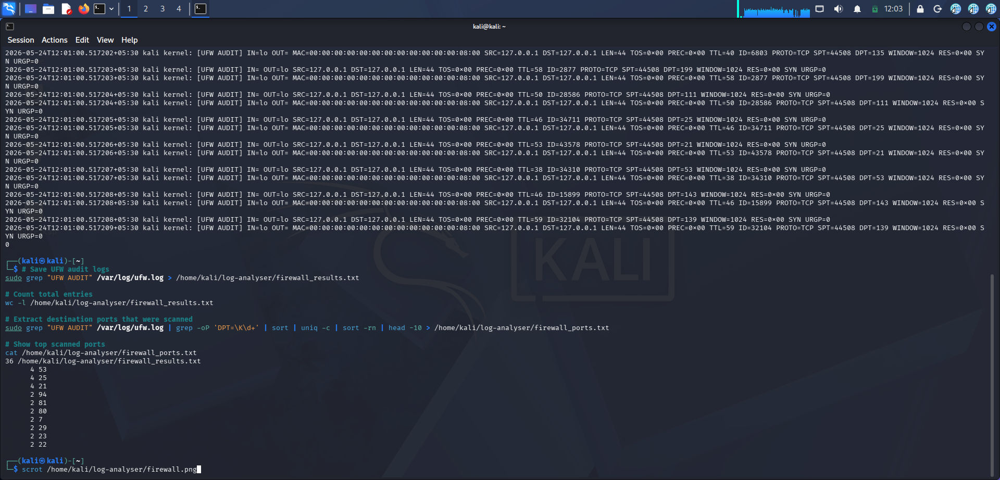
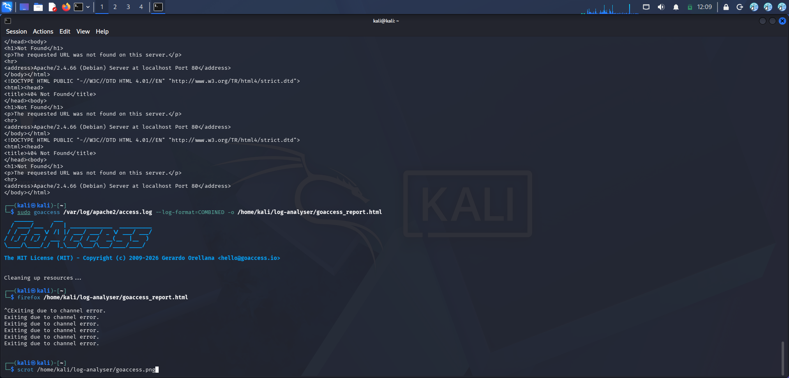

# log-analyser

Hands-on log analysis and threat detection using four tools on Kali Linux. Analyses SSH auth logs, firewall logs, and web server logs for suspicious activity and attack patterns.

> ⚠️ All analysis performed on my own local Kali Linux machine.

---

## Tools Used

| Tool | Purpose | Log Type |
|------|---------|----------|
| **grep + awk** | Command line log analysis | SSH auth logs |
| **Fail2ban** | Automated SSH brute force detection | Auth logs |
| **UFW Firewall** | Firewall traffic analysis | UFW audit logs |
| **GoAccess** | Web server log visualisation | Apache access logs |

---

## Environment

- OS: Kali Linux (VirtualBox)
- Date: May 2026

---

## Tool 1 — grep + awk (SSH Auth Log Analysis)

### What it does
Uses Linux built-in commands to search through auth logs and find
failed SSH login attempts and suspicious IPs.

### Commands used
```bash
# Find all failed SSH logins
sudo grep -a "Failed password" /var/log/auth.log

# Count failed attempts per IP
sudo grep -a "Failed password" /var/log/auth.log | awk '{print $11}' | sort | uniq -c | sort -rn

# Save results
sudo grep -a "Failed password" /var/log/auth.log > failed_logins.txt
sudo grep -a "Invalid user" /var/log/auth.log >> failed_logins.txt
```

### Results
- Failed login attempts detected and saved to `failed_logins.txt`
- IP addresses ranked by number of attempts saved to `ip_count.txt`

---

## Tool 2 — Fail2ban (Automated Brute Force Detection)

### What it does
Monitors auth logs in real time and automatically bans IPs that
exceed a threshold of failed login attempts.

### Setup
```bash
sudo apt install fail2ban -y
sudo systemctl start fail2ban
sudo systemctl enable fail2ban
```

### Configuration (`/etc/fail2ban/jail.local`)
```
[sshd]
enabled = true
port = ssh
filter = sshd
logpath = /var/log/auth.log
maxretry = 3
bantime = 600
findtime = 600
```

### Commands used
```bash
sudo fail2ban-client status
sudo fail2ban-client status sshd
```

### What I learned
Fail2ban is a first line of defence against SSH brute force attacks.
After 3 failed attempts from the same IP within 10 minutes it
automatically adds a firewall rule to block that IP for 10 minutes.

---

## Tool 3 — UFW Firewall Log Analysis

### What it does
UFW (Uncomplicated Firewall) logs all incoming connection attempts.
Analysing these logs reveals port scans and reconnaissance activity.

### Commands used
```bash
# Enable UFW logging
sudo ufw logging medium

# Extract scanned ports
sudo grep "UFW AUDIT" /var/log/ufw.log | grep -oP 'DPT=\K\d+' | sort | uniq -c | sort -rn
```

### Results — Top scanned ports

| Count | Port | Service | Risk |
|-------|------|---------|------|
| 4 | 53 | DNS | DNS server probe |
| 4 | 25 | SMTP | Mail server probe |
| 4 | 21 | FTP | FTP server probe |
| 2 | 80 | HTTP | Web server probe |
| 2 | 22 | SSH | SSH brute force target |
| 2 | 23 | Telnet | Telnet probe |

### What I learned
Port scan activity is clearly visible in firewall logs — multiple ports
hit from the same source IP in a short time window is a strong indicator
of reconnaissance. Ports 21, 22, 23, 25, 53, 80 are the most commonly
probed as they reveal running services.

### Screenshot


---

## Tool 4 — GoAccess (Web Server Log Visualisation)

### What it does
GoAccess analyses Apache/Nginx access logs and generates a visual
HTML dashboard showing visitors, requested URLs, response codes,
and traffic patterns.

### Command used
```bash
sudo goaccess /var/log/apache2/access.log --log-format=COMBINED -o goaccess_report.html
```

### Test traffic generated
```bash
curl http://localhost
curl http://localhost/admin
curl http://localhost/login
curl http://localhost/test
curl http://localhost/phpmyadmin
```

### What I learned
Web server logs reveal exactly what pages are being requested and
which return errors. Requests to `/admin`, `/phpmyadmin`, and `/login`
from unknown IPs are red flags — they indicate automated scanning
or brute force attempts against web admin panels.

### Live Report
[View GoAccess Report](https://Manojgolla0516.github.io/log-analyser/goaccess_report.html)

### Screenshot


---

## Key Takeaways

- **grep + awk** is the fastest way to triage logs — no tools needed
- **Fail2ban** automates the response to brute force attacks
- **Firewall logs** reveal port scans and reconnaissance activity
- **Web logs** expose automated scanners and admin panel probes
- Combining multiple log sources gives a complete picture of threats

---

## Repository Structure

```
log-analyser/
├── README.md
├── failed_logins.txt       ← SSH failed login attempts
├── ip_count.txt            ← IPs ranked by attempt count
├── firewall_results.txt    ← UFW firewall audit log
├── firewall_ports.txt      ← Top scanned ports
├── goaccess_report.html    ← GoAccess web log report
└── screenshots/
    ├── firewall.png
    └── goaccess.png
```

---

## Disclaimer

All analysis was performed on my own local Kali Linux machine.
No external systems were monitored or accessed.

---

## License

MIT
